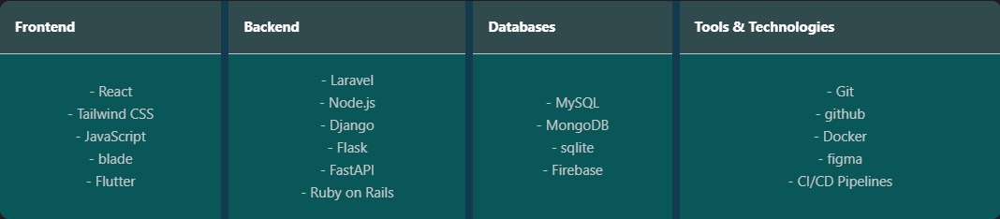
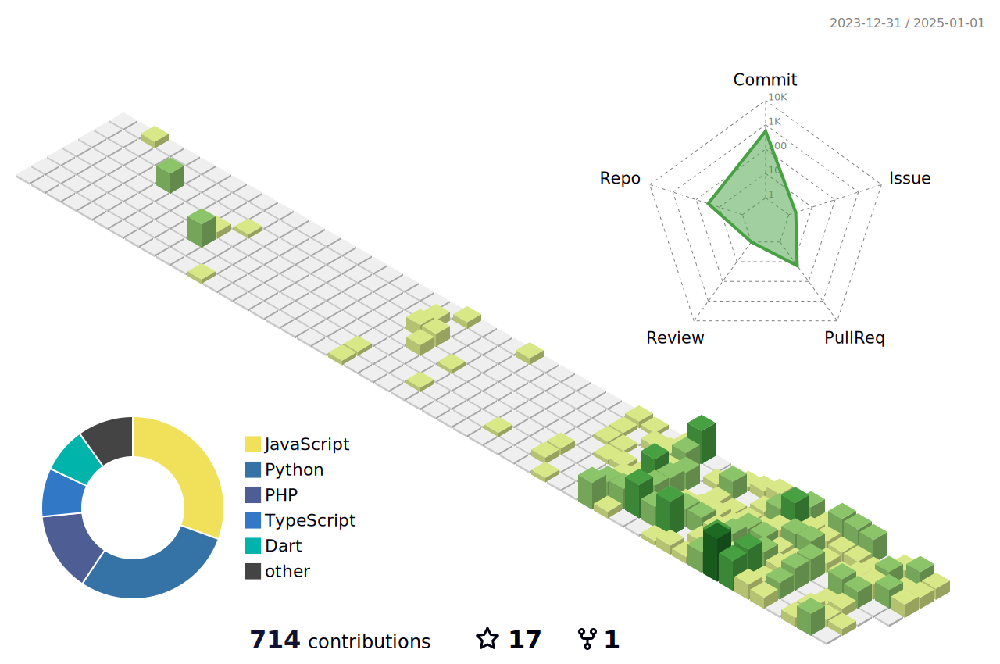

<h1 align="center">
  
  𝐇𝐞𝐥𝐥𝐨, &lt;𝚌𝚘𝚍𝚎𝚛𝚜/&gt;!
  
</h1>

<h3 align="left">👨‍💻 About Me</h3>

  I'm Abdulrahman Ali Radan  
  - 🔭 A dedicated Full-Stack Developer with a focus on creating scalable web solutions and impactful tools for developers. 
  - 🎓 Computer Science student, graduating in 2025, with a strong passion for web development and AI integration. 
  - 📚 Currently working on an AI-powered proctoring system for online exams, leveraging deep learning and computer vision techniques to detect cheating in real-time. 
  - 💡 Passionate about exploring innovative web solutions and continuously enhancing my skills in modern technologies. 
  - ⚡ Enjoy tackling complex coding challenges, sharing knowledge through tutorials, and collaborating on open-source projects. 

<h2 align="left">⚡️ Where to find me</h2>

  
  
  
  
  
  
  
  

---

<h3 align="left">🛠️ Skills</h3>

<!--    -->

  <table style="width: 90%; border-collapse: collapse; border-radius: 10px; overflow: hidden; background-color: #205E9DFF; box-shadow: 2 4px 18px rgba(0, 0, 0, 0.26);">
    <tr style="background-color: #314A4DFF; color: white; text-align: center;">
      <th style="padding: 15px; border-top-left-radius: 10px; border-right: 8px solid #123B4FFF">Frontend</th>
      <th style="padding: 15px; border-right: 8px solid #123B4FFF;">Backend</th>
    </tr>
    <tr style="background-color: #0A575AFF;">
      <td style="padding: 15px; text-align: center; border-right: 8px solid #123B4FFF;">
        - React 
        - Vue.js 
        - Tailwind CSS 
        - JavaScript 
        - Flutter
      </td>
      <td style="padding: 15px; text-align: center; border-right: 8px solid #123B4FFF">
        - Laravel 
        - Node.js 
        - Django 
        - Flask 
        - FastAPI 
        - Ruby on Rails
      </td>
    </tr>
  </table>

 <!--   -->

 
 

 

 

  

   •
   •
  

<h2 align="center">🔥 My Stats</h2>

   

  

    
    
  

<!--  -->
